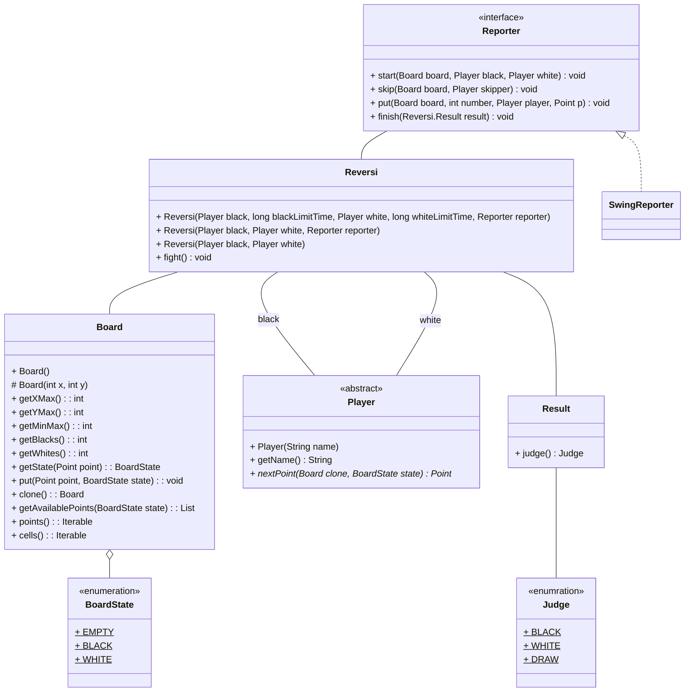

# 概要
本リポジトリは、リバーシを作るための超シンプルなJavaの実装です。
一応、Scalaでも実装を追加していける状態にはしています。

# 作成目的
本格的なReversiを作っていくというよりは、プログラミングを楽しく学んでもらうためツールとして作成しています。
作成者的には、チームビルディングの一環として、Playerの実装をチームで行って頂き、どのチームが一番強かったかを競ってもらったりするのに利用しています。

# いいわけ
１０年近く前に作ったモノを掘り起こしてるので、実装ダサいのは勘弁な！
後、専門学校の学生向けに作成しているので、コードは冗長というか、平易な書き方をしています。

# クラス構造



# Player実装について
Playerの実装は```nextPoint()```メソッドで自分の石を置く場所を返却すれば良いです。
ただし以下の条件のいずれかを満たした場合は無条件に負けになります。
1,2の条件については、```Board#getAvailablePoints()```で返却されるいずれかのPointさえ返していれば発生はしません。

1. nullを返却する
1. おけない場所を返却する（一箇所も置く場所が無ければ）```nextPoint()```メソッドは呼び出されません）
1. メソッドが呼び出されてから２秒以内に返答をしなかった（２秒はデフォルトです。Reversiクラス作成時に変更は可能です）

# Playerの参考
現在、いくつかのサンプル実装があるのでそれらのクラスを参考にしてみてください。

|クラス名|どんな実装？|
|---|---|
|[SimplePlayer](src/main/java/reversi/impl/SimplePlayer.java)|```getAvailablePoints()```の最初のPointを返すだけ|
|[SimpleScalaPlayer](src/main/scala/reversi/impl/SimpleScalaPlayer.scala)|```SimplePlayer```のScala実装|
|[BeginerPlayer](src/main/java/reversi/impl/BeginerPlayer.java)|次の一手で自分の石の数が最大になるPointを返す|
|[Champion](src/main/java/reversi/impl/Champion.java)|これまでで一番強かったやつ|

# Playerを実装する上で使われるであろうAPI
## [Board](src/main/java/reversi/Board.java)
|メソッド名|概要|
|---|---|
|getAvaliablePoins|引数で渡した石を置くことが可能なPointオブジェクトの一覧を返却します|
|clone|現在のBoardオブジェクトをクローンして返却します。将来の盤の状態をシミュレートして一番良いPointを返却したいという様な処理を実装する際に利用してください|
|getBlack|黒の石がいくつあるかを返却します|
|getWhite|白の石がいくつあるかを返却します|
